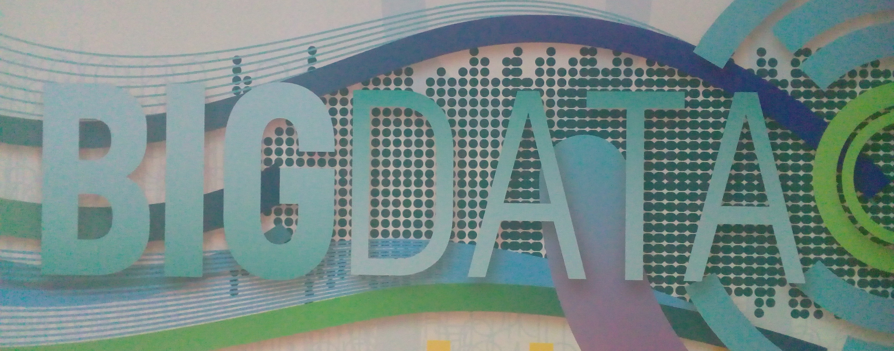
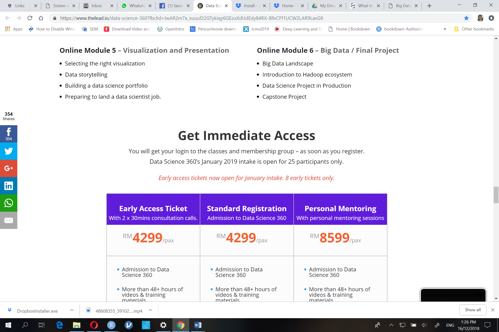
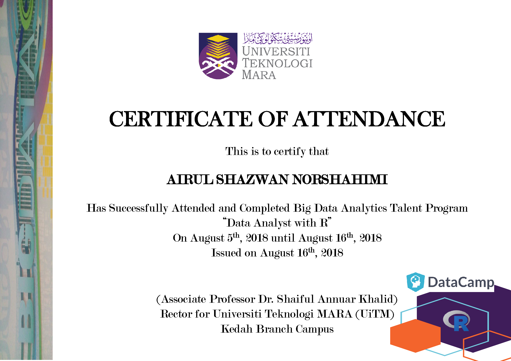
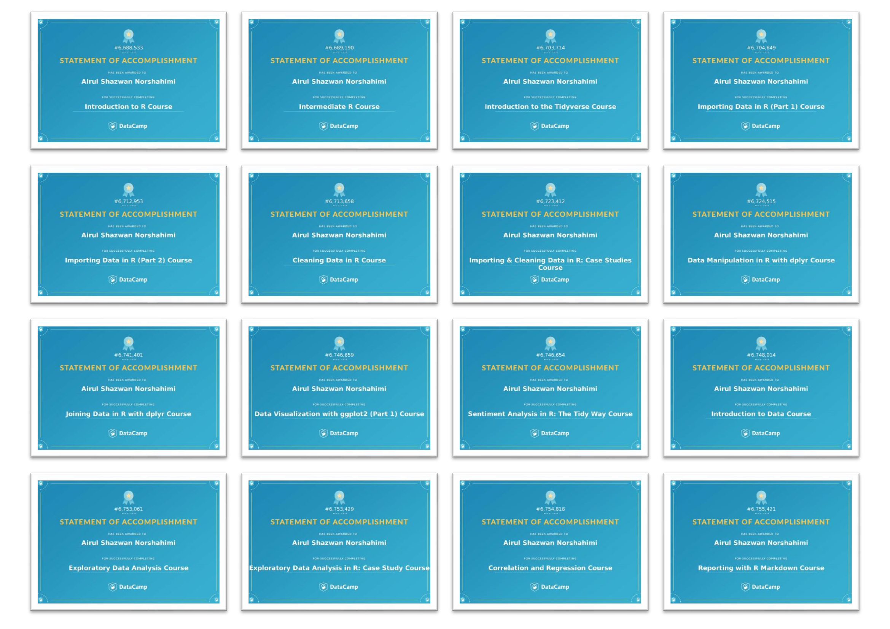
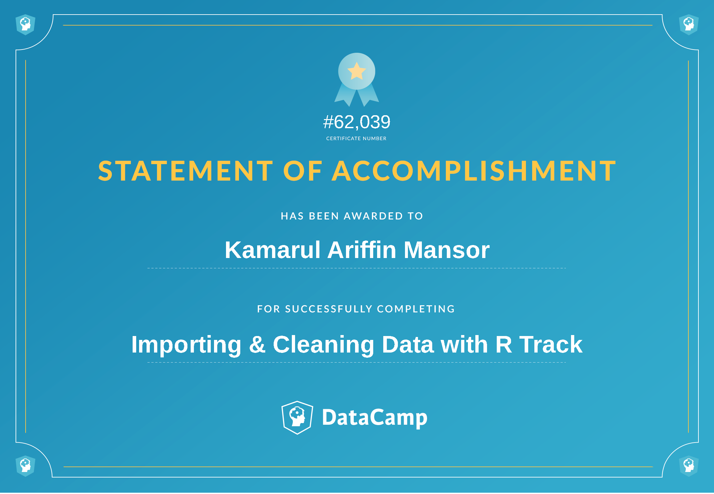
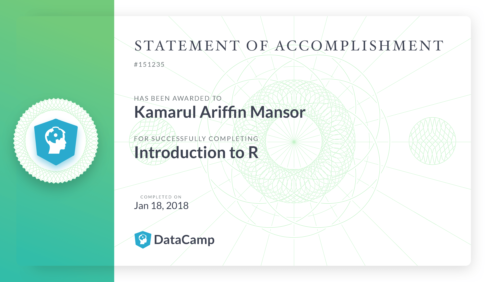
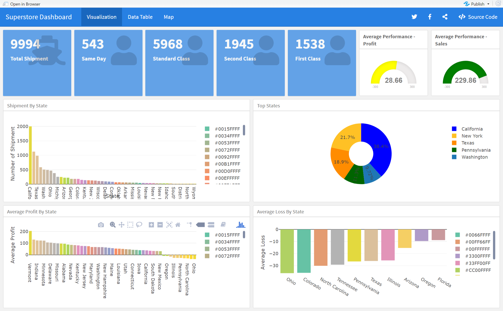
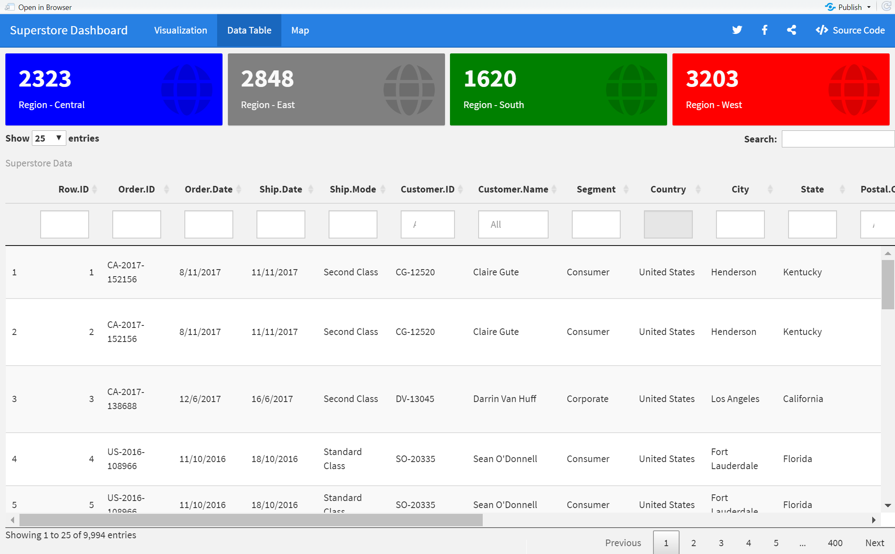
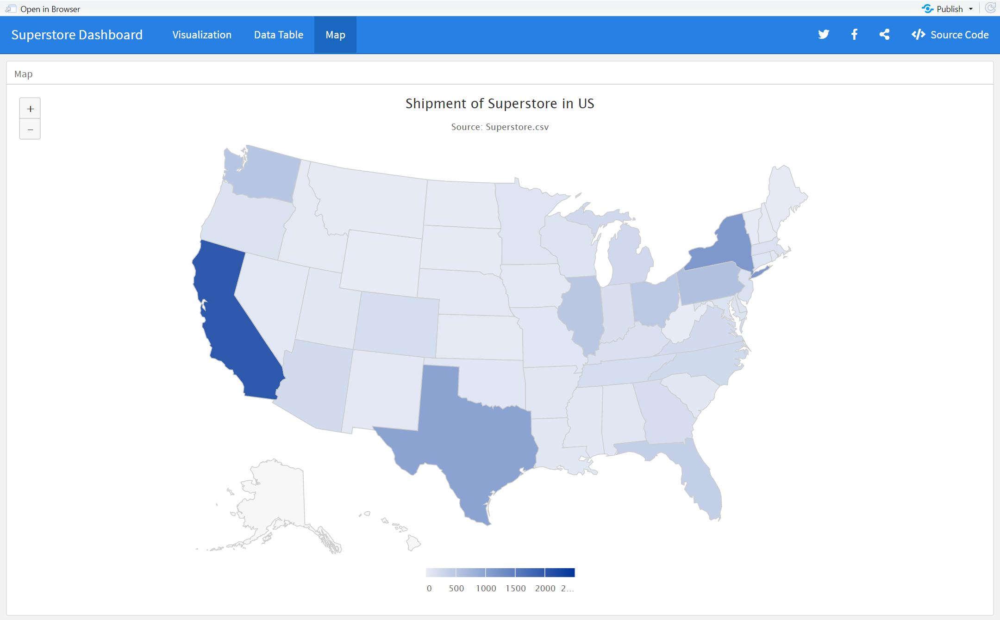

<link rel="stylesheet" href="styles.css" type="text/css">

  
  

  

---  

## Pendahuluan
Melalui penubuhan empat belas (14) unit Makmal Data Raya di kampus-kampus di UiTM dijangka akan membantu negara dalam meningkatkan jumlah data profesional dalam bidang analitik data raya di Malaysia.  
  
Program ini dijangka akan menghasilkan seramai 2,340 bakat analitik data raya setahun yang mana sekurang-kurangnya seramai 180 orang perlu dihasilkan di setiap Fakulti/Kampus UiTM setahun.  
  
DataCamp adalah satu platform pengajaran dan pembelajaran secara dalam talian dalam bidang sains data. Platform ini menawarkan trek dan modul dalam bidang sains data termasuk analitik data raya yang boleh diikuti menggunakan platform Massive Online Open Course (MOOC).  
  
---  

## Nama Program
Program Pembangunan Bakat Analitik Data Raya – “Data Analyst With R” & "Python Programming"  
Siri Ke-3
  
---  

## Objektif  
- memberi pendedahan kepada para pelajar platform pembelajaran atas talian Datacamp  
- memberi pendedahan kepada para pelajar pengatucaraan R dan Python di dalam analisa data raya
- melahirkan lebih ramai graduan yang mahir di dalam bidang analitik data raya di Malaysia  
  
---  

## Penganjur  
Program ini dianjurkan oleh Bahagian Hal Ehwal Akademik UiTM Cawangan Kedah.  
  
---  

## Maklumat Program 
Data Analyst with R   
Tarikh: 15 Julai 2019 - 5 Ogos 2019 (16 hari - kecuali cuti hujung minggu) **  
  
Python Programmer   
Tarikh: 15 Julai - 28 Julai, 2019 (10 hari - kecuali cuti hujung minggu) **  
  
Tempat: Makmal Big Data, UiTM Cawangan Kedah  

** Tertakhluk kepada perubahan bergantung kepada tarikh akhir pelajar menduduiki peperiksaan akhir.  

**Cara Pembelajaran**  
Pembelajaran dilakasanakan di dalam 2 mode:  
  
1. Face-to-Face - 2 hari pertama tarikh program diadakan, dari jam 8 pagi hingga 5 petang, bertempat di Makmal Big Data, UiTM Kedah.  
2. Self Online Learning - pembelajaran secara atas talian (dikawal selia oleh fasilitator).  
  
*Peserta perlu habiskan semua modul mengikut trek pilihan di dalam tempoh masa yang ditetapkan*
  
---  

## Yuran dan Pendaftaran  
Yuran penyertaan ada **RM200** untuk trek pertama yang didaftar sahaja.  
Pendaftaran boleh dibuat secara online dengan mengisi Google Form di pautan berikut: [Klik Untuk Mendaftar](https://goo.gl/forms/V4DnuvYnrcSLKHa53).  
Tarikh akhir pendaftaran dan pembayaran adalah pada 30hb Jun, 2019.  
Pelajar yang telah mendaftar dikehendaki membuat bayaran deposit sebanyak **RM50** sebelum atau pada tarikh 30 Jun, 2019 dan selebihnya dibayar pada 15 Julai, 2019.  
Bayaran deposit boleh dibuat terus secara tunai kepada Encik Kamarul Ariffin Mansor, Blok Akademik 2, Bilik A2-1020. Resit rasmi pembayaran akan dikeluarkan apabila bayaran penuh telah dibuat pada 15 Julai 2019.  
  
Yuran RM200 yang dikenakan termasuk:  
1. Sesi 'face-to-face' bersama fasilitator selama 2 hari (minum pagi, makan tengahari dan minum petang disediakan)  
2. Penggunaan Makmal Big Data sepanjang kursus dari 8 pagi - 5 petang kecuali pada cuti hujung minggu.  
3. Pembelajaran percuma bagi semua modul bagi trek pilihan pelajar (R atau Python).  
4. Sijil tamat kursus yang diiktiraf oleh Malaysia Digital Economy Corporation (MDEC).  

  
| Nota           | Perbandingan kursus yang sama di organisasi luar |  
|----------------|:------------------------------------------------:|  
|Kursus          ||  
|Kos             ||  
  
---  

## Penceramah / Fasilitator  
Kamarul Ariffin Mansor (R Software)  
Dr. Taniza Tajuddin (Python)  
	
---  

## Peserta  
- Peserta adalah terdiri dari pelajar semester 3 dan ke atas di peringkat Diploma dan Sarjana Muda UiTM.  
- Pelajar tahun akhir dan pelajar yang akan melaksanakan Latihan lndustri pada semester berikutnya adalah digalakkan.  
- Pelajar Pascasiswazah juga dibolehkan mengikuti program ini.  
- Peserta yang lulus pada Ujian Saringan yang dilaksanakan dalam talian.  
  
---  

## Jawatankuasa  
Penaung: **Prof. Madya Dr. Shaiful Annuar Khalid (Rektor)**  
Penasihat I: **Dr. Abdul Majeed Ahmad (Timbalan Rektor HEA)**  
Penasihat II:	**Dr. Wan Irham Ishak**  
Pengurus Program:  
1. Kamarul Ariffin Mansor  
2. Dr. Taniza Tajuddin  
  
---  

## Trek dan Modul {.tabset}

### Data Analyst with R  
UiTM Kedah akan mengendalikan TREK Data Analyst with R dimana bersesuaian dengan majoriti pelajar yang mengambil jurusan pengurusan dan sains sosial. Program ini akan berjalan selama 16 hari (1 hari 1 kursus/modul)  
  
Trek ini diajar kaedah menggunakan kemahiran pengaturcaraan untuk mengumpulkan data (data wrangling) dan membina alatan (tool development) untuk analisa data. Modul yang terlibat adalah:  
  
1. Introduction to R  
2. Intermediate R  
3. Introduction to The Tidyverse  
4. Importing Data in R (Part 1)  
5. Importing Data in R (Part 2)  
6. Cleaning Data in R  
7. Importing & Cleaning Data in R: Case Study  
8. Data Manipulation in R With dplyr  
9. Joining Data in R with dplyr  
10.	Data Visualization with ggplot2 (Part 1)  
11.	Sentiment Analysis in R: The Tidy Way  
12.	Introduction to Data  
13.	Exploratory Data Analysis  
14.	Exploratory Data Analysis in R: Case Study  
15.	Correlation & Regression  
16.	Reporting with R Markdown  
  
### Python Programming  
Python Program dimana bersesuaian kepada pelajar yang mengambil bidang teknikal seperti Sains Komputer. Program ini akan berjalan selama 10 hari (1 hari 1 kursus / modul).  Programmer Python menggunakan kemahiran pengaturcaraan mereka untuk membantah data dan membina alat untuk analisis data. Modul yang perlu dipelajari adalah:  
  
1. Introduction to Python for Data Science  
2. Intermediate Python for Data Science  
3. Python Data Science Toolbox (Part 1)  
4. Python Data Science Toolbox (Part 2)  
5. Importing Data in Python (Part 1)  
6. Importing Data in Python (Part 2)  
7. Cleaning Data in Python  
8. pandas Foundations  
9. Manipulating DataFrames with pandas  
10. Introduction to Databases in Python  
  
---  

## Pensijilan Profesional Program
Peserta yang telah lulus dan berjaya memenuhi semua pentaksiran dan berjaya menyelesaikan bagi setiap modul/kemahiran yang diperlukan di dalam Trek akan mendapat Sijil Tamat Trek dan Sijil Tamat setiap modul.  
  
| Contoh Sijil |  
|:------------:|  
| |  
| |  
  
---  

## Galeri  
**Interactive Dashboard Creation using R**  

    

---  

## Pertanyaan  

Sebarang pertanyaan berkenaan program, sila hubungi:

**Kamarul Ariffin Mansor**  
**Faculty of Computer and Mathematical Sciences**  
**UiTM Kedah Branch Campus**  
Email: k.a.mansor@hotmail.com    
HP: +60124336901  

